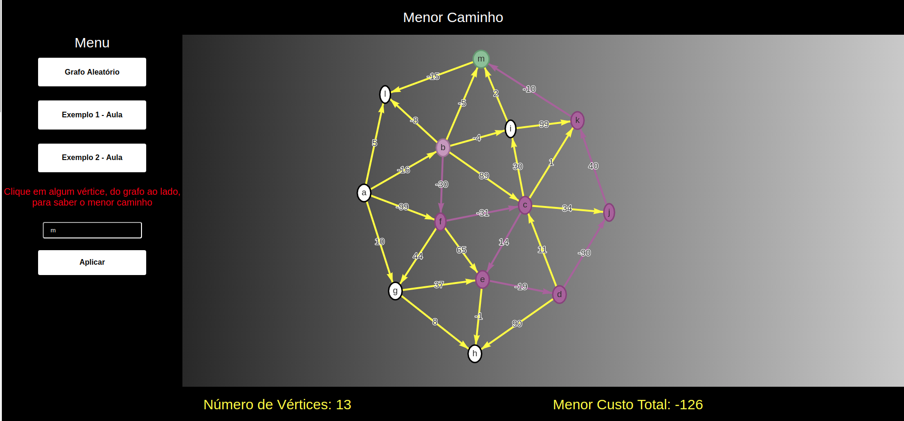
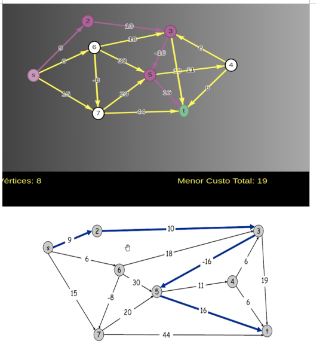
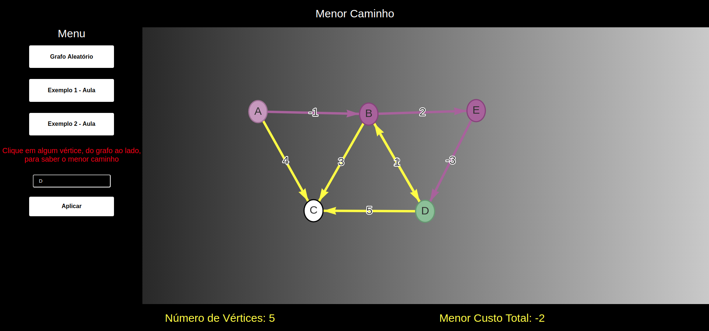
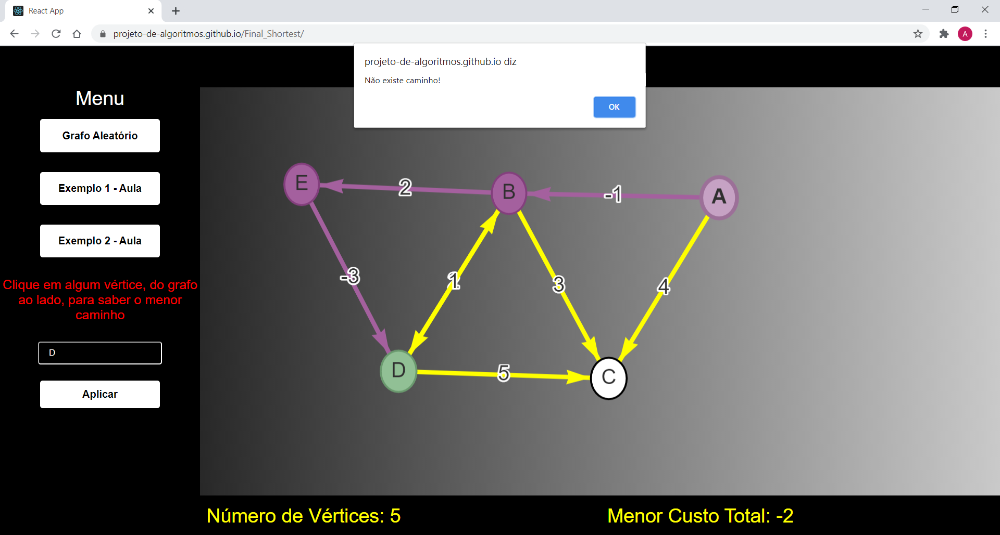

# ShortestVis

**Número da Lista**: 6 
**Conteúdo da Disciplina**: Projeto Final 

## Alunos

| Matrícula  | Aluno            |
| ---------- | ---------------- |
| 16/0112974 | Arthur Rodrigues |

## Sobre

O projeto pode ser acessado no link abaixo:
    
   
   [https://projeto-de-algoritmos.github.io/Final_Shortest](https://projeto-de-algoritmos.github.io/Final_Shortest)
    
O projeto é basicamente um visualizador interativo de menor caminho em grafos, com arestas de pesos positivos e negativos, utilizando o algoritmo de Bellman Ford. Três modelos de grafos estão disponíveis: Aleatório, Exemplo 1 e Exemplo 2.

## Vídeo Explicativo
Disponível no link abaixo:

[https://www.youtube.com/watch?v=l9lGU0iasuY](https://www.youtube.com/watch?v=l9lGU0iasuY)

## Screenshots
 

Grafo Aleatório

Nó início: 'b' nó destino: 'm' 

Exemplo 1 

Exemplo 2

Erro 1 ( Ao clicar no vértice 'C')

## Instalação

**Linguagem**: JavaScript 
**Framework**: React 

Primeiramente utilizaremos a ferramenta [git](https://git-scm.com/downloads) que é necessária para clonar o repositório:

    $ git clone https://github.com/projeto-de-algoritmos/Final_Shortest

Após clonar o repositório, é preciso acessar a pasta 'shortest' do projeto:

    Exemplo para o linux:

    $ cd Final_Shortest/shortest

Para rodar o projeto é necessário ter instalado o [yarn](https://classic.yarnpkg.com/pt-BR/docs/install/#debian-stable) na versão estável mais atual.

Após instalar o yarn, vamos instalar as dependências do projeto.

    Na pasta 'shortest', execute:

    $ yarn install

Depois, subir o servidor:

    $ yarn start

E então acessar no navegador:

    http://localhost:3000/Final_Shortest

## Uso

1 - A tela inicial aparece então é necessário escolher uma das três opções existentes de grafos. 

2 - Após isso digite o nó final(destino) e aperte em aplicar.

3 - Aplicado é só escolher um nó no grafo gerado ao lado e é mostrado o menor caminho.
## Outros

No console do navegador é possível ver o memoization da solução.
